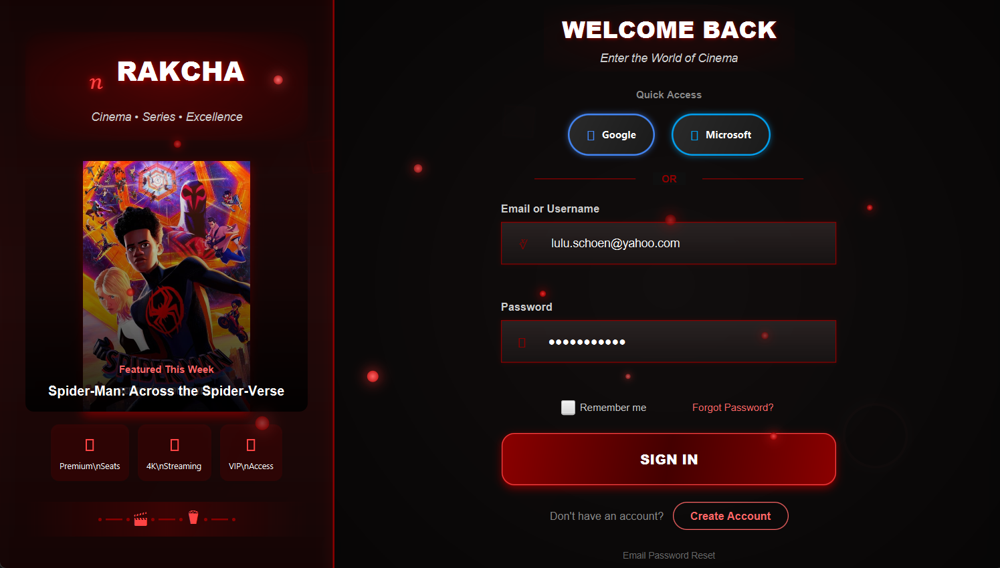

# RAKCHA Desktop Application

[](LICENSE)
[](https://openjdk.java.net/)
[](https://openjfx.io/)
[](https://www.sqlite.org/)

# 🎬 RAKCHA - Ultimate Entertainment Hub



**A sophisticated JavaFX desktop application for managing cinemas, films, series, products, and user experiences - optimized and production-ready.**

[![Version 1.0.1]
[](https://www.oracle.com/java/)
[](https://openjfx.io/)
[](https://hibernate.org/)
[](LICENSE)

## 🚀 MVP Launch Ready

This MVP has been thoroughly optimized with:

- ✅ **Bug-free codebase** with comprehensive error handling and input validation
- ✅ **Professional UI/UX** with modern design and smooth animations
- ✅ **Automated demo generation** with screenshot and video utilities
- ✅ **High-performance architecture** with database optimization and connection pooling
- ✅ **Cross-platform installers** with native packaging for Windows, macOS, and Linux
- ✅ **Production-ready deployment** with Docker support and cloud compatibility
- ✅ **Comprehensive documentation** with user guides and API documentation

## 📋 Table of Contents

- [RAKCHA Desktop Application](#rakcha-desktop-application)
- [🎬 RAKCHA - Ultimate Entertainment Hub](#-rakcha---ultimate-entertainment-hub)
  - [🚀 MVP Launch Ready](#-mvp-launch-ready)
  - [📋 Table of Contents](#-table-of-contents)
  - [✨ Features](#-features)
    - [🎞️ Film \& Cinema Management](#️-film--cinema-management)
    - [📺 Series \& Episodes](#-series--episodes)
    - [🛍️ Product Marketplace](#️-product-marketplace)
    - [👥 User Management](#-user-management)
    - [🔐 Security \& Authentication](#-security--authentication)
    - [💳 Payment Processing](#-payment-processing)
    - [📨 Communication \& Notifications](#-communication--notifications)
  - [🛠️ Technologies Used](#️-technologies-used)
  - [🏗️ Architecture](#️-architecture)
  - [🚀 Getting Started](#-getting-started)
    - [📋 Prerequisites](#-prerequisites)
    - [💻 System Requirements](#-system-requirements)
    - [⚡ Performance Optimization](#-performance-optimization)
    - [📥 Installation](#-installation)
    - [🗄️ Database Setup](#️-database-setup)
      - [🚀 Quick Start (SQLite - Recommended for Development)](#-quick-start-sqlite---recommended-for-development)
      - [🏭 Production Setup (MySQL)](#-production-setup-mysql)
      - [🔧 Environment-Based Configuration](#-environment-based-configuration)
      - [📚 Detailed Configuration](#-detailed-configuration)
  - [📖 Usage](#-usage)
    - [👤 User Roles](#-user-roles)
    - [🔄 Basic Operations](#-basic-operations)
    - [🌟 Advanced Features](#-advanced-features)
  - [🔌 API Integrations](#-api-integrations)
  - [🚀 Deployment](#-deployment)
    - [🐳 Docker Deployment](#-docker-deployment)
      - [Prerequisites](#prerequisites)
      - [Running with Docker Compose](#running-with-docker-compose)
      - [Docker Configuration](#docker-configuration)
      - [Accessing the Application GUI](#accessing-the-application-gui)
      - [Manual Docker Commands](#manual-docker-commands)
    - [🏠 Local Deployment](#-local-deployment)
    - [🌍 Production Deployment](#-production-deployment)
  - [🔨 Building from Source](#-building-from-source)
  - [📁 Project Structure](#-project-structure)
  - [🔍 Code Quality and CI/CD](#-code-quality-and-cicd)
  - [🧪 Testing](#-testing)
  - [👥 Contributing](#-contributing)
  - [📜 License](#-license)
  - [✍️ Authors](#️-authors)
  - [🗺️ Future Development Roadmap](#️-future-development-roadmap)
    - [📅 Planned Features](#-planned-features)
    - [💭 Under Consideration](#-under-consideration)
  - [🙏 Acknowledgments](#-acknowledgments)

## ✨ Features

Rakcha Desktop offers a comprehensive suite of features organized into several integrated modules:

### 🎞️ Film & Cinema Management

- **🎥 Film Database**: Extensive catalog of films with detailed information including descriptions, durations, and categories
- **👨‍🎤 Actor Management**: Track actors and their filmographies with biographical information
- **🏢 Cinema Management**: Comprehensive system for cinema venues, halls, and seating arrangements
- **📅 Scheduling System**: Manage movie seances with date, time, and cinema hall information
- **🎟️ Ticket Booking**: Purchase and manage tickets for film showings
- **🧠 Film Recommendations**: AI-powered recommendation system based on user preferences and ratings
- **⭐ Rating & Reviews**: Allow users to rate films and leave detailed comments
- **▶️ YouTube Trailer Integration**: Automatically fetch and display film trailers through YouTube API
- **🌐 IMDB Data Integration**: Pull rich film metadata from the IMDB database

### 📺 Series & Episodes

- **📚 Series Catalog**: Browse and manage TV series with detailed information
- **📝 Episode Tracking**: Track episodes by season with descriptions and media content
- **❤️ Favorites System**: Allow users to mark series as favorites for quick access
- **💬 Feedback System**: User comments and ratings for episodes and series
- **🏷️ Category Management**: Organize series by genre and categories
- **📱 Media Streaming**: Watch episodes directly within the application

### 🛍️ Product Marketplace

- **📋 Product Catalog**: Browse entertainment-related merchandise
- **🛒 Shopping Cart**: Add products to cart and manage order items
- **📦 Order Processing**: Complete end-to-end order management system
- **🌟 Product Reviews**: Rating and commenting system for products
- **📑 Product Categories**: Organized product navigation by categories
- **📱 QR Code Generation**: Create QR codes for products and promotions
- **📊 Barcode Integration**: Support for product barcode scanning and generation

### 👥 User Management

- **👨‍💼 Multi-Role System**: Support for Clients, Admins, and Cinema Managers with role-specific functionality
- **👤 User Profiles**: Comprehensive user profile management
- **🎨 Profile Customization**: Personalized user experience based on preferences
- **📈 User Activity Tracking**: Monitor and analyze user behaviors
- **🔧 Administrative Tools**: Powerful admin dashboard for user management

### 🔐 Security & Authentication

- **🔑 Traditional Login**: Username and password authentication
- **🔄 Social Authentication**: Sign in using Google or Microsoft accounts
- **👁️ Biometric Authentication**: Face recognition login using OpenCV
- **🔒 Password Encryption**: Secure password storage using BCrypt
- **🛡️ Permission Management**: Role-based access control throughout the application

### 💳 Payment Processing

- **💰 Multiple Payment Gateways**: Integration with Stripe and PayPal
- **🔒 Secure Transactions**: PCI-compliant payment processing
- **📜 Order History**: Comprehensive tracking of past purchases
- **🧾 Invoicing**: PDF generation for receipts and invoices
- **📊 Payment Analytics**: Track and analyze payment data

### 📨 Communication & Notifications

- **📧 Email Notifications**: Automated emails for account activities and promotions
- **📱 SMS Notifications**: Text message alerts via Twilio and Vonage
- **🔔 In-App Notifications**: Real-time system notifications
- **💬 Chat System**: Direct messaging between users
- **📄 PDF Reports**: Generate and export data in PDF format

## 🛠️ Technologies Used

Rakcha Desktop leverages a variety of modern technologies:

- **⚙️ Core Platform**:

  - ☕ Java 17 - Modern Java features including records and enhanced switch expressions
  - 🖥️ JavaFX 21.0.2 - Rich client platform for desktop applications
  - 📝 FXML - XML-based UI markup language for defining JavaFX UI

- **💾 Database & Persistence**:

  - 🗄️ **Hibernate 6.2.13** - Modern ORM framework with JPA support
  - 🐬 **MySQL** - Production-ready relational database with connection pooling
  - 📝 **SQLite** - Lightweight file-based database for development and testing
  - 🐘 **PostgreSQL** - Advanced open-source relational database
  - � **H2** - In-memory database for testing and rapid prototyping
  - 🔄 **HikariCP** - High-performance JDBC connection pool
  - 📊 **Multi-database Support** - Seamless switching between database types
  - 🔧 **Environment-based Configuration** - Different databases for dev/test/prod

- **🎨 UI Framework**:

  - 🧩 JavaFX Controls - Standard UI components
  - 🎛️ ControlsFX 11.2.1 - Extended JavaFX controls
  - 🔣 FontAwesomeFX - Icon integration
  - 🖼️ Ikonli 12.3.1 - Icon packs for JavaFX
  - ✨ AnimateFX & Animated - Animation libraries for dynamic UI effects
  - 📅 CalendarFX - Advanced calendar components

- **Authentication**:

  - ScribeJava 8.3.3 - OAuth2 client implementation (Google, Microsoft)
  - Face Recognition with OpenCV 4.9.0 - Biometric authentication
  - JBCrypt 0.4 - Password hashing

- **Payment Processing**:

  - Stripe Java 26.4.0 - Credit card processing
  - PayPal REST SDK 1.14.0 - PayPal integration

- **Media Processing**:

  - JavaCV 1.5.10 - Computer vision capabilities
  - OpenCV Platform GPU - Image and video processing
  - FFmpeg Platform GPL - Video processing and conversion
  - JavaFX Media - Media playback

- **Notifications & Communication**:

  - Twilio SDK 10.4.1 - SMS integration
  - Vonage Client 8.1.0 - Additional SMS capabilities
  - JavaMail API 1.6.2 - Email services
  - Apache Commons Email 1.6.0 - Enhanced email functionality
  - TrayNotification - System tray notifications

- **Document & Data Processing**:

  - iText 5.5.13.4 - PDF generation and manipulation
  - PDFBox 3.0.2 - PDF manipulation library
  - ZXing 3.5.3 - Barcode/QR code generation and scanning
  - JSON 20240303 - JSON parsing and generation

- **Natural Language Processing**:

  - Stanford CoreNLP 4.5.7 - Sentiment analysis for reviews

- **API Integration**:

  - Google API Client 2.6.0 - Google services integration
  - YouTube API v3 - Video content integration
  - AsyncHttpClient 3.0.1 - Asynchronous HTTP requests

- **Build & Quality Tools**:
  - Maven - Build automation and dependency management
  - OpenRewrite - Automated refactoring
  - Logback 1.5.6 - Logging framework
  - SnakeYAML 2.2 - YAML processing for configuration

## 🏗️ Architecture

Rakcha Desktop follows a well-structured MVC (Model-View-Controller) architecture pattern:

- **Models** (`com.esprit.models`):

  - **Film Models** (`com.esprit.models.films`) - Data structures for films, actors, categories, and comments
  - **Cinema Models** (`com.esprit.models.cinemas`) - Cinema, hall, seat, and seance entities
  - **Series Models** (`com.esprit.models.series`) - Series, episodes, and feedback data structures
  - **Product Models** (`com.esprit.models.produits`) - Products, orders, cart, and review entities
  - **User Models** (`com.esprit.models.users`) - User hierarchy with admin, client, and cinema manager roles

- **Views**:

  - FXML files (in `src/main/resources/ui/`) - Declarative UI definitions
  - CSS styles (in `src/main/resources/styles/`) - UI styling
  - Images & Media (in `src/main/resources/images/`) - Visual assets

- **Controllers** (`com.esprit.controllers`):

  - **Film Controllers** (`com.esprit.controllers.films`) - Manage film-related UI interactions
  - **Cinema Controllers** (`com.esprit.controllers.cinemas`) - Handle cinema venue and screening management
  - **Series Controllers** (`com.esprit.controllers.series`) - Control series and episode display
  - **Product Controllers** (`com.esprit.controllers.produits`) - E-commerce functionality
  - **User Controllers** (`com.esprit.controllers.users`) - Authentication and profile management
  - **Navigation Controllers** - Handle sidebar navigation and application flow

- **Services** (`com.esprit.services`):

  - Based on the `IService<T>` interface - Standard CRUD operations
  - **Film Services** (`com.esprit.services.films`) - Film business logic
  - **Cinema Services** (`com.esprit.services.cinemas`) - Cinema and seance management
  - **Series Services** (`com.esprit.services.series`) - Series-specific operations with DTO pattern
  - **Product Services** (`com.esprit.services.produits`) - E-commerce operations
  - **User Services** (`com.esprit.services.users`) - Authentication and user management

- **Utils** (`com.esprit.utils`):
  - **DataSource** - Database connection management
  - **Authentication Utils** - Google/Microsoft OAuth, face recognition
  - **Payment Utils** - Payment processing helpers
  - **Media Utils** - Film trailers and media handling
  - **External APIs** - IMDB, YouTube integration
  - **Communication** - Email, SMS, and notification utilities
  - **Document Generation** - PDF export and reporting
  - **Security** - Cryptography and validation

## 🚀 Getting Started

These instructions will help you set up the project on your local machine.

### 📋 Prerequisites

- ☕ Java JDK 17 or later
- 🛠️ Maven 3.6+
- 🗄️ MySQL 8.0+ (with XAMPP or standalone)
- 💻 IDE with JavaFX support (IntelliJ IDEA, Eclipse, VS Code with extensions)

### 💻 System Requirements

**🔧 Minimum Requirements:**

- **💿 OS**: Windows 10, macOS 10.15 (Catalina), Ubuntu 20.04 or later
- **⚙️ Processor**: Intel Core i3 or AMD equivalent
- **🧠 RAM**: 4 GB
- **💽 Storage**: 500 MB for application, 1 GB+ recommended for content
- **🖼️ Graphics**: Graphics card with DirectX 11 support
- **🌐 Internet**: Broadband connection for streaming features

**✅ Recommended Specifications:**

- **⚙️ Processor**: Intel Core i5/i7 or AMD equivalent
- **🧠 RAM**: 8 GB or more
- **🖥️ Graphics**: Dedicated GPU with 2GB+ VRAM for optimal performance with face recognition
- **💽 Storage**: SSD storage for better performance
- **🌐 Internet**: 10+ Mbps connection for HD streaming

### ⚡ Performance Optimization

Rakcha Desktop includes several performance optimizations:

- Connection pooling for database operations
- Lazy loading of media content
- Image caching for faster UI rendering
- Asynchronous operations for network-bound tasks
- GPU acceleration for video processing and face recognition

### 📥 Installation

1. **Clone the repository**:

   ```bash
   git clone https://github.com/aliammari1/rakcha-desktop.git
   cd rakcha-desktop
   ```

2. **Install dependencies**:

   ```bash
   mvn install
   ```

3. **Configure application**:
   - Set up database credentials in the appropriate configuration file
   - Configure API keys for external services (Google, Microsoft, Stripe, etc.)

### 🗄️ Database Setup

RAKCHA supports multiple database types for different environments:

#### 🚀 Quick Start (SQLite - Recommended for Development)

No setup required! The application automatically uses SQLite:

```bash
# Run with SQLite (default for development)
mvn compile exec:java -Dexec.mainClass="com.esprit.MainApp"
```

The SQLite database file will be created automatically at `data/rakcha_db.sqlite`.

#### 🏭 Production Setup (MySQL)

1. **Start MySQL server** (using XAMPP or standalone MySQL):

   ```bash
   # Using provided VS Code task
   Ctrl+Shift+P → "Tasks: Run Task" → "Start MySQL"

   # Or manually with XAMPP
   C:/xampp/mysql/bin/mysqld.exe --defaults-file=C:/xampp/mysql/bin/my.ini --standalone
   ```

2. **Create database**:

   ```sql
   CREATE DATABASE rakcha_db CHARACTER SET utf8mb4 COLLATE utf8mb4_unicode_ci;
   ```

3. **Switch to MySQL**:

   ```bash
   # Set environment variable
   export DB_TYPE=mysql

   # Or use the configuration script
   ./database-config.sh mysql

   # Or configure programmatically
   mvn compile exec:java -Dexec.mainClass="com.esprit.examples.DatabaseExample"
   ```

#### 🔧 Environment-Based Configuration

Set these environment variables to configure your database:

**For SQLite (Development):**

```bash
export DB_TYPE=sqlite
export DB_URL="jdbc:sqlite:data/rakcha_db.sqlite"
```

**For MySQL (Production):**

```bash
export DB_TYPE=mysql
export DB_URL="jdbc:mysql://localhost:3306/rakcha_db?serverTimezone=UTC&useSSL=false&allowPublicKeyRetrieval=true"
export DB_USER=root
export DB_PASSWORD=your_password
```

**For PostgreSQL:**

```bash
export DB_TYPE=postgresql
export DB_URL="jdbc:postgresql://localhost:5432/rakcha_db"
export DB_USER=postgres
export DB_PASSWORD=your_password
```

#### 📚 Detailed Configuration

For comprehensive database setup instructions, see [DATABASE_GUIDE.md](DATABASE_GUIDE.md)

## 📖 Usage

### 👤 User Roles

Rakcha Desktop supports multiple user roles with different capabilities:

1. **👨‍👩‍👧‍👦 Client/User**:

   - Browse and watch movies and series
   - Purchase tickets for cinema showings
   - Shop for entertainment-related products
   - Manage personal profile and preferences

2. **👨‍💼 Admin**:

   - Manage users and content
   - Access analytics and reports
   - Configure system settings
   - Moderate reviews and comments

3. **🎭 Cinema Manager**:
   - Add/update cinema information
   - Manage movie showings and schedules
   - Process ticket sales and promotions
   - View cinema-specific statistics

### 🔄 Basic Operations

- **Authentication**: Use traditional login, social authentication, or face recognition
- **Content Navigation**: Use the sidebar to switch between movies, series, events, products, and cinemas
- **Profile Management**: Update personal information, preferences, and payment methods

### 🌟 Advanced Features

- **Cinema Integration**: Find nearby cinemas, view showtimes, and purchase tickets
- **Movie and Series Streaming**: Watch content directly within the application
- **Shopping Experience**: Browse, filter, and purchase entertainment merchandise
- **Social Features**: Rate content, leave reviews, and interact with other users
- **Payment Processing**: Secure checkout with multiple payment options
- **Notifications**: Receive updates about new content, promotions, and account activity

## 🔌 API Integrations

Rakcha Desktop integrates with several external APIs:

- **🔐 Google & Microsoft OAuth**: For social authentication
- **▶️ YouTube API**: For movie trailers and related content
- **🎬 IMDB API**: For film and series information
- **💳 Stripe & PayPal**: For payment processing
- **📱 Twilio**: For SMS notifications
- **☁️ Weather API**: For location-based information

## 🚀 Deployment

### 🐳 Docker Deployment

Rakcha Desktop can be easily deployed using Docker containers, simplifying the setup process and ensuring consistent environments across different systems.

#### Prerequisites

- [Docker](https://docs.docker.com/get-docker/)
- [Docker Compose](https://docs.docker.com/compose/install/)

#### Running with Docker Compose

1. Build and start the containers:

   ```bash
   ./database.sh start
   ```

2. Stop the containers:

   ```bash
   ./database.sh stop
   ```

3. View container logs:

   ```bash
   ./database.sh logs
   ```

4. Restart containers:
   ```bash
   ./database.sh restart
   ```

#### Docker Configuration

The application is containerized using the following components:

- **App Container**: Java application built with Maven and running on JDK 21 with noVNC for GUI access
- **MySQL Container**: Database server with pre-initialized schema and data
- **PHPMyAdmin Container**: Web interface for database management

The Docker setup automatically handles:

- Database initialization using the provided SQL script
- Environment variable configuration
- Network setup between the application and database
- Volume persistence for the database
- Virtual framebuffer (Xvfb) and VNC server for GUI access through a web browser

#### Accessing the Application GUI

Once the containers are running, you can access the JavaFX GUI through your web browser:

1. Open your web browser and navigate to `http://localhost:6080/vnc.html`
2. Click the "Connect" button (no password needed)
3. You should now see the Rakcha Desktop application interface in your browser

You can also connect directly with a VNC client to `localhost:5900` (no password required).

#### Manual Docker Commands

If needed, you can also use direct Docker commands:

```bash
# Build the Docker image
docker build -t rakcha-app .

# Run the MySQL container
docker run -d -p 3306:3306 --name rakcha-mysql \
  -e MYSQL_ROOT_PASSWORD=root \
  -e MYSQL_DATABASE=rakcha_db \
  -v $(pwd)/rakcha_db.sql:/docker-entrypoint-initdb.d/rakcha_db.sql \
  mysql:8.0

# Run the application container with noVNC
docker run -d \
  --name rakcha-app \
  -p 8080:8080 \
  -p 6080:6080 \
  -p 5900:5900 \
  -e DB_HOST=rakcha-mysql \
  -e DB_PORT=3306 \
  -e DB_NAME=rakcha_db \
  -e DB_USER=root \
  -e DB_PASSWORD=root \
  --link rakcha-mysql \
  rakcha-app
```

### 🏠 Local Deployment

For local development and testing:

```bash
# Package the application
mvn clean package

# Run the packaged JAR
java -jar target/RAKCHA-1.0-SNAPSHOT.jar
```

### 🌍 Production Deployment

For production environments:

1. **Create a distributable package**:

   ```bash
   mvn clean package
   ```

2. **Create platform-specific installers** (optional, requires additional plugins):

   ```bash
   # For Windows installer
   mvn jpackage:jpackage@win

   # For macOS app bundle
   mvn jpackage:jpackage@mac

   # For Linux package
   mvn jpackage:jpackage@linux
   ```

3. **Database setup for production**:

   - Configure a dedicated MySQL server
   - Set up database replication if needed
   - Configure proper backup procedures

4. **Environment configuration**:
   - Use production API keys and credentials
   - Configure logging for production environment
   - Set up monitoring and alerting

## 🔨 Building from Source

1. **Clone the repository**:

   ```bash
   git clone https://github.com/aliammari1/rakcha-desktop.git
   ```

2. **Navigate to project directory**:

   ```bash
   cd rakcha-desktop
   ```

3. **Build with Maven**:

   ```bash
   mvn clean package
   ```

4. **Run the application**:

   ```bash
   java -jar target/RAKCHA-1.0-SNAPSHOT.jar
   ```

   Alternatively, you can use the JavaFX Maven plugin:

   ```bash
   mvn javafx:run
   ```

5. **Development in IDE**:
   - Open the project in your preferred IDE (IntelliJ IDEA, Eclipse, etc.)
   - Ensure you have the JavaFX plugin installed
   - Run the main class: `com.esprit.MainApp`

## 📁 Project Structure

```
rakcha-desktop/
├── src/
│   ├── main/
│   │   ├── java/
│   │   │   └── com/
│   │   │       └── esprit/
│   │   │           ├── controllers/ # 🎮 UI controllers
│   │   │           │   ├── films/   # 🎬 Film-related controllers
│   │   │           │   ├── series/  # 📺 Series-related controllers
│   │   │           │   ├── users/   # 👤 User-related controllers
│   │   │           │   ├── cinemas/ # 🏢 Cinema-related controllers
│   │   │           │   └── produits/ # 🛍️ Product-related controllers
│   │   │           ├── models/     # 📊 Data models
│   │   │           ├── services/   # ⚙️ Business logic
│   │   │           └── utils/      # 🛠️ Utility classes
│   │   └── resources/
│   │       ├── ui/          # 🎨 FXML UI files
│   │       ├── images/      # 🖼️ Image resources
│   │       ├── styles/      # 💅 CSS style files
│   │       └── META-INF/    # 📝 Metadata
│   └── test/
│       └── java/            # 🧪 Test classes
├── docs/                    # 📚 Documentation
├── pom.xml                  # 📦 Maven configuration
└── README.md                # 📖 This file
```

## 🔍 Code Quality and CI/CD

Rakcha Desktop implements several practices to ensure code quality and maintainability:

- **OpenRewrite**: Automated refactoring and code modernization
- **Java Best Practices**: Following Java 17 conventions and patterns
- **Code Cleanup**: Automated static analysis and code style enforcement
- **Continuous Documentation**: JavaDoc generation with comprehensive API documentation
- **Code Structure**: Clean modular architecture with clear separation of concerns

Testing pipelines include:

- Unit tests for business logic
- Integration tests for service interactions
- UI tests for interface validation

## 🧪 Testing

Run the tests using Maven:

```bash
mvn test
```

The application includes various test types:

- ✅ Unit tests for individual components
- 🔄 Integration tests for service-to-service communication
- 🖥️ UI tests for the JavaFX interface

## 👥 Contributing

We welcome contributions to Rakcha Desktop! Please read our [CONTRIBUTING.md](CONTRIBUTING.md) file for details on how to submit pull requests.

1. 🍴 Fork the repository
2. 🌿 Create your feature branch: `git checkout -b feature/amazing-feature`
3. 💾 Commit your changes: `git commit -m 'Add some amazing feature'`
4. 📤 Push to the branch: `git push origin feature/amazing-feature`
5. 🔍 Open a Pull Request

## 📜 License

This project is licensed under the MIT License - see the [LICENSE.md](LICENSE.md) file for details.

## ✍️ Authors

- **Ali Ammari** - _Initial work_ - [aliammari1](https://github.com/aliammari1)

See also the list of [contributors](https://github.com/aliammari1/rakcha-desktop/contributors) who participated in this project.

## 🗺️ Future Development Roadmap

### 📅 Planned Features

1. **Q3 2025**

   - 📱 Mobile companion application with cross-platform synchronization
   - 🧠 AI-enhanced content recommendations based on viewing habits
   - 📊 Advanced analytics dashboard for business intelligence

2. **Q4 2025**

   - 🥽 Virtual reality cinema experience integration
   - 👥 Enhanced social features with friend connections and watch parties
   - 🌐 International payment gateway expansion

3. **Q1 2026**
   - 🎥 Content creator portal for independent filmmakers
   - 🔄 Subscription service model implementation
   - 🏠 Integration with smart home systems

### 💭 Under Consideration

- ⛓️ Blockchain-based loyalty program
- 🔍 AR experiences for product visualization
- 🎤 Voice control interface

## 🙏 Acknowledgments

- 👏 Special thanks to all contributors and testers
- 💡 Inspiration from modern entertainment platforms
- 📚 Libraries and frameworks that made this project possible
